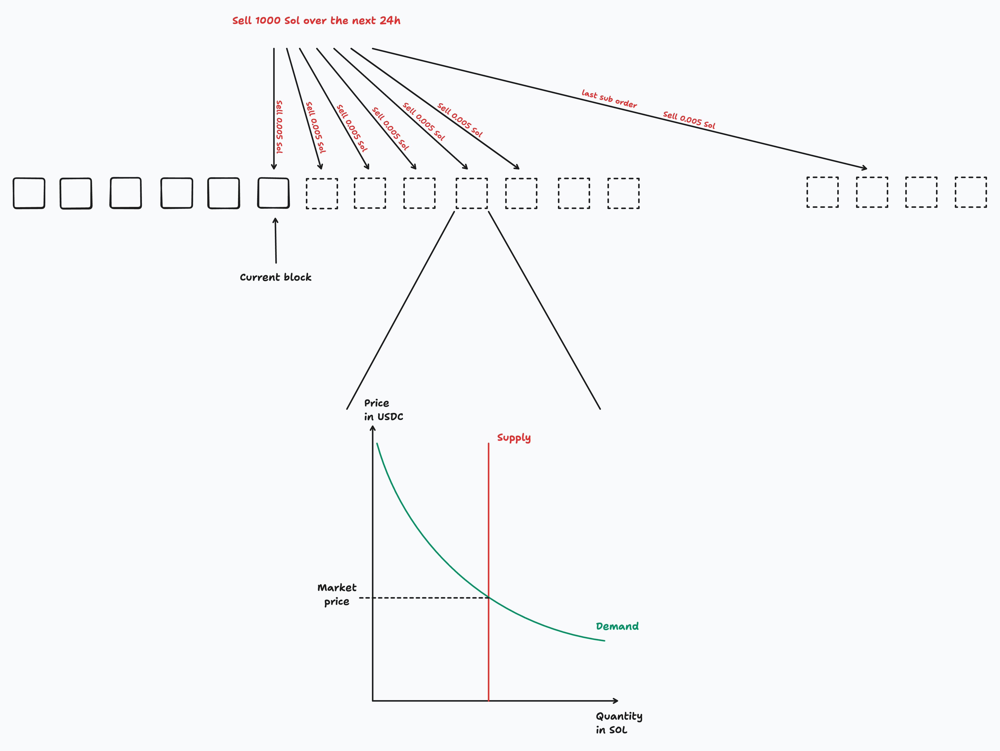

# Mato

Mato is a Solana mobile trading app, where users choose an amount and a duration and let orders stream into the market over time.

## Continuous Clearing Auctions

It uses a continuous clearing auction: the market clears continuously as buy and sell flow changes. That is cool because it can reduce instantaneous price impact, make execution fairer, and weaken toxic flow such as sandwiching.

