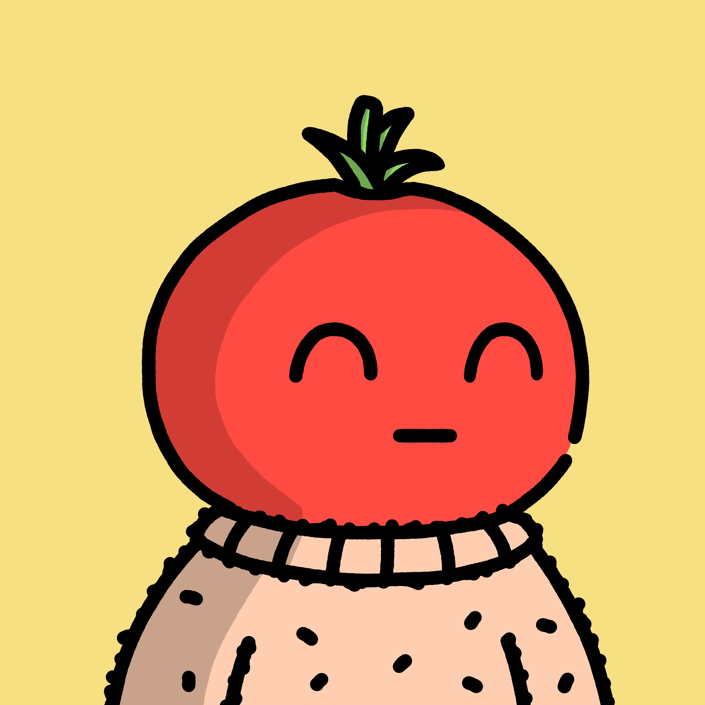

<!-- _class: title-slide -->

# MATO

## Streaming the Internet Capital Markets

Continuous orders. Uniform clearing. Deeper liquidity.

SOLANA MOBILE HACKATHON March 2026

---

## What Internet Capital Markets Need

- Less toxic flow and timing games
- Deep liquidity
- Fast, credible price discovery
- Fair execution quality across participants

---

## Time-weighted order book

- Orders stream continuously over user-chosen duration
- Uniform clearing price per time unit
  → no sandwich attacks

---

## Time-weighted order book

- Price impact depends on time + size
  → deeper liquidity via time dimension
- Makers update quotes anytime; users exit anytime
- Fully onchain, no oracles

---

## How it works

Order = Quantity + Limit* + Duration

- Choose amount + duration (e.g., sell 25 SOL over 10s)
- Every incoming or outgoing order updates market price
- All active orders stream at current market price

*Limit orders are not implemented yet

---

## SMS Integration

What We Implemented In Mato

- `MobileWalletProvider` + `createSolanaDevnet` for Solana Mobile wallet discovery/session context.
- Mobile Wallet Adapter `transact(...)` flow for connect/disconnect and signed actions.
- MWA `authorize` / `deauthorize` with app identity; auth token caching for fast reconnect.
- Wallet-signed v0 transactions via `signAndSendTransactions` for submit order and close position.

---

## What we built

---

## Market Opportunity

Capturing the MEV tax

- 82k SOL extracted from Solana users via sandwich attacks in the past 30 days
  -> tax on billions in monthly DEX volume
- Pain is real and widespread
- Most retail is already patient

Mato fixes it

- Uniform clearing, zero sandwiches
- Native Dollar-cost-averaging, smoother avg prices

---

## Team

Two builders, one wedge: Internet Capital Markets

  

    
    
Thomas

    
Product, protocol design, and engineering.

    <ul class="team-bullets">
      <li>Superteam Germany member.</li>
      <li>Software Engineer @StakingFacilities.</li>
      <li>Background in physics and economics.</li>
    </ul>
  

  

    
    
Gopi

    
Engineering and partnerships.

    <ul class="team-bullets">
      <li>President of TUM Blockchain Club.</li>
      <li>Software Engineer @SolanaBeach.</li>
      <li>Background in Computer Science.</li>
    </ul>
  

Combined edge: protocol insight + production execution.

---

## Ask + Roadmap

- Pilot partners for TWOB market-quality testing
- Liquidity collaborators and benchmark reviewers
- Mainnet hardening toward production rollouts

**Mato is a market structure bet.**

TWOB can help Solana deliver deeper, fairer, less toxic markets.

